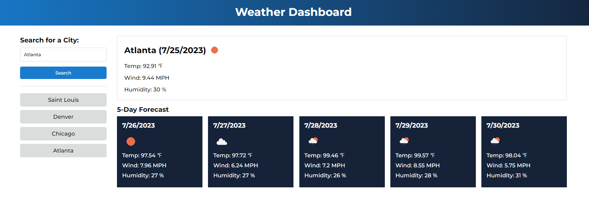

# weather-challenge-6

## Description
This project was created to build a weather dashboard that allows users to
search for the current weather and a 5-day forecast of any city.

Users can also check their search history and quickly access weather information for previously searched cities.

## Live link
[**https://yiseo.github.io/weather-challenge-6/**](https://yiseo.github.io/weather-challenge-6/)

## Screenshot

## Installation
N/A

## Technologies Used
- HTML
- CSS
- Javascript
- Github